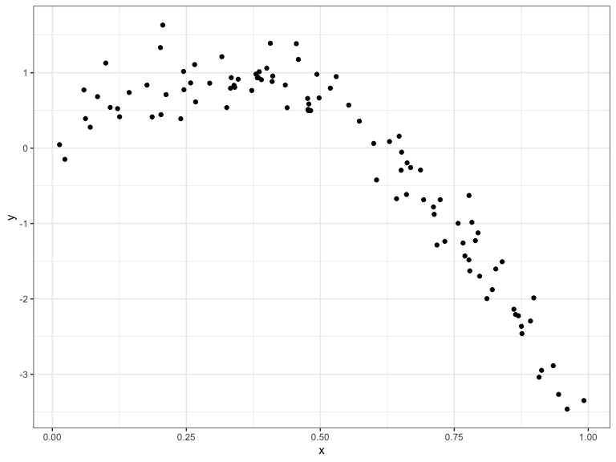
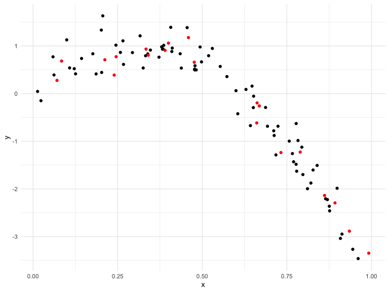
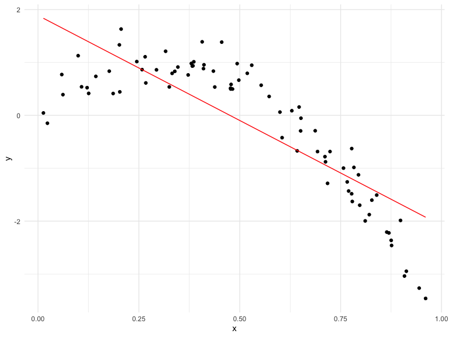
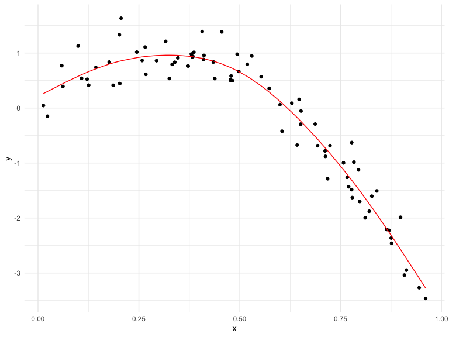
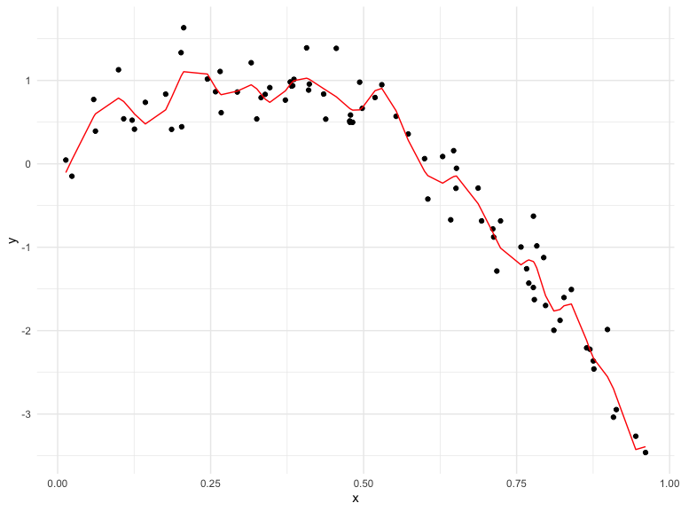
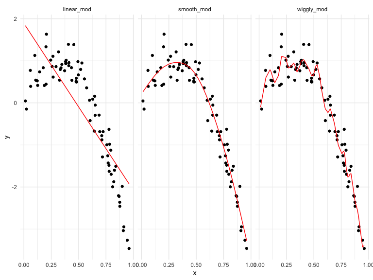
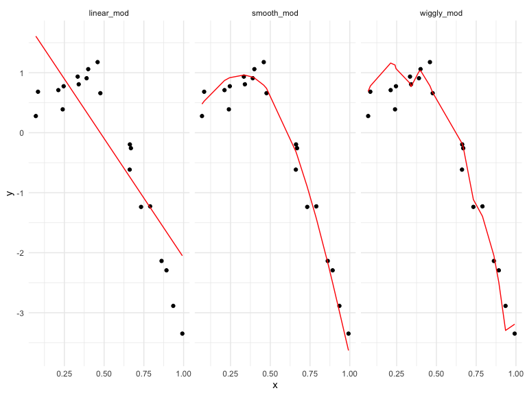

cross\_validation
================
Weijia Xiong
11/12/2019

``` r
nonlin_df = 
  tibble(
    id = 1:100,
    x = runif(100, 0, 1),
    y = 1 - 10 * (x - .3) ^ 2 + rnorm(100, 0, .3)
  )

nonlin_df %>% 
  ggplot(aes(x = x, y = y)) + 
  geom_point() + theme_bw()
```



Training and Testing:

``` r
train_df = sample_n(nonlin_df, 80)
test_df = anti_join(nonlin_df, train_df, by = "id") # x y not match 
## nonlin_df - train_df

ggplot(train_df, aes(x = x, y = y)) + 
  geom_point() +  ## train 
  geom_point(data = test_df, color = "red")  ## testing
```



Use mgcv

gam: generalized addictive model

polynomial models. Y=α0+α1x1+α2x2+α11x21+α22x22+α12x1x2+ϵ

``` r
linear_mod = lm(y ~ x, data = train_df)
smooth_mod = mgcv::gam(y ~ s(x), data = train_df)
wiggly_mod = mgcv::gam(y ~ s(x, k = 30), sp = 10e-6, data = train_df) ## sp Smoothing parameters, k is the dimensionality of the spline basis expansion of 1 or possibly more covariates.

train_df %>% 
  add_predictions(linear_mod) %>% 
  ggplot(aes(x = x, y = y)) + geom_point() + 
  geom_line(aes(y = pred), color = "red")   #prediction line
```



``` r
train_df %>% 
  add_predictions(smooth_mod) %>% 
  ggplot(aes(x = x, y = y)) + geom_point() + 
  geom_line(aes(y = pred), color = "red")   #prediction line
```



``` r
train_df %>% 
  add_predictions(wiggly_mod) %>% 
  ggplot(aes(x = x, y = y)) + geom_point() + 
  geom_line(aes(y = pred), color = "red")
```



``` r
train_df %>% 
  gather_predictions(linear_mod, smooth_mod, wiggly_mod) %>% 
  mutate(model = fct_inorder(model)) %>%  # reorder factors levels by first appearance, frequency or numeric order
  ggplot(aes(x = x, y = y)) + 
  geom_point() + 
  geom_line(aes(y = pred), color = "red") + 
  facet_wrap(~model)
```



Focus on the performance of test df

``` r
test_df %>% 
  gather_predictions(linear_mod, smooth_mod, wiggly_mod) %>% 
  mutate(model = fct_inorder(model)) %>%  # reorder factors levels by first appearance, frequency or numeric order
  ggplot(aes(x = x, y = y)) + 
  geom_point() + 
  geom_line(aes(y = pred), color = "red") + 
  facet_wrap(~model)
```



Compare RMSE for test
df

``` r
rmse(linear_mod, test_df)
```

    ## [1] 0.7052956

``` r
rmse(smooth_mod, test_df) ## small rmse. for test df, fits better. this is more important!!!
```

    ## [1] 0.2221774

``` r
rmse(wiggly_mod, test_df)  
```

    ## [1] 0.289051

``` r
## putting more staffs in training df
rmse(smooth_mod, train_df) 
```

    ## [1] 0.2874834

``` r
rmse(wiggly_mod, train_df) ## for train df, this fits better
```

    ## [1] 0.2498309

But above is only one test. However, to get a sense of model stability
we really need to iterate this whole process. Of course, this could be
done using loops but that’s a hassle
