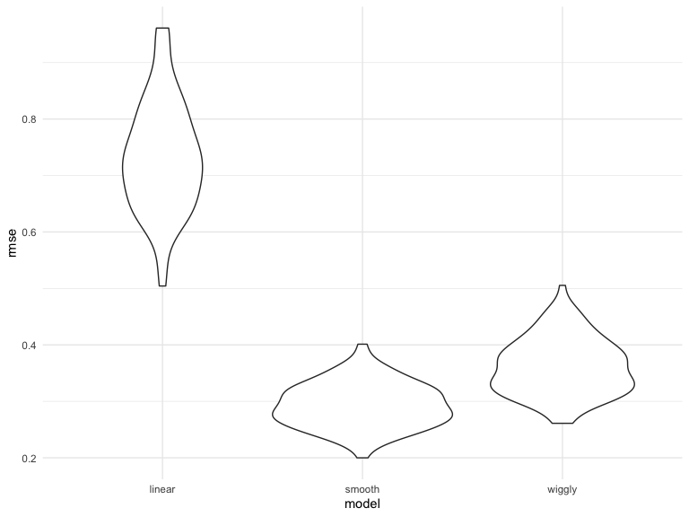

cross\_validation
================
Weijia Xiong
11/12/2019

``` r
nonlin_df = 
  tibble(
    id = 1:100,
    x = runif(100, 0, 1),
    y = 1 - 10 * (x - .3) ^ 2 + rnorm(100, 0, .3)
  )

nonlin_df %>% 
  ggplot(aes(x = x, y = y)) + 
  geom_point() + theme_bw()
```


## Training and Testing:

``` r
train_df = sample_n(nonlin_df, 80)
test_df = anti_join(nonlin_df, train_df, by = "id") # x y not match 
## nonlin_df - train_df

ggplot(train_df, aes(x = x, y = y)) + 
  geom_point() +  ## train 
  geom_point(data = test_df, color = "red")  ## testing
```


Use mgcv

gam: generalized addictive model

polynomial models. Y=α0+α1x1+α2x2+α11x21+α22x22+α12x1x2+ϵ

``` r
linear_mod = lm(y ~ x, data = train_df)
smooth_mod = mgcv::gam(y ~ s(x), data = train_df)
wiggly_mod = mgcv::gam(y ~ s(x, k = 30), sp = 10e-6, data = train_df) ## sp Smoothing parameters, k is the dimensionality of the spline basis expansion of 1 or possibly more covariates.

train_df %>% 
  add_predictions(linear_mod) %>% 
  ggplot(aes(x = x, y = y)) + geom_point() + 
  geom_line(aes(y = pred), color = "red")   #prediction line
```


``` r
train_df %>% 
  add_predictions(smooth_mod) %>% 
  ggplot(aes(x = x, y = y)) + geom_point() + 
  geom_line(aes(y = pred), color = "red")   #prediction line
```


``` r
train_df %>% 
  add_predictions(wiggly_mod) %>% 
  ggplot(aes(x = x, y = y)) + geom_point() + 
  geom_line(aes(y = pred), color = "red")
```


``` r
train_df %>% 
  gather_predictions(linear_mod, smooth_mod, wiggly_mod) %>% 
  mutate(model = fct_inorder(model)) %>%  # reorder factors levels by first appearance, frequency or numeric order
  ggplot(aes(x = x, y = y)) + 
  geom_point() + 
  geom_line(aes(y = pred), color = "red") + 
  facet_wrap(~model)
```


Focus on the performance of test df

``` r
test_df %>% 
  gather_predictions(linear_mod, smooth_mod, wiggly_mod) %>% 
  mutate(model = fct_inorder(model)) %>%  # reorder factors levels by first appearance, frequency or numeric order
  ggplot(aes(x = x, y = y)) + 
  geom_point() + 
  geom_line(aes(y = pred), color = "red") + 
  facet_wrap(~model)
```


Compare RMSE for test
df

``` r
rmse(linear_mod, test_df)
```

    ## [1] 0.7052956

``` r
rmse(smooth_mod, test_df) ## small rmse. for test df, fits better. this is more important!!!
```

    ## [1] 0.2221774

``` r
rmse(wiggly_mod, test_df)  
```

    ## [1] 0.289051

``` r
## putting more staffs in training df
rmse(smooth_mod, train_df) 
```

    ## [1] 0.2874834

``` r
rmse(wiggly_mod, train_df) ## for train df, this fits better
```

    ## [1] 0.2498309

But above is only one test. However, to get a sense of model stability
we really need to iterate this whole process. Of course, this could be
done using loops but that’s a hassle

## Cross Validation

``` r
cv_df = 
  crossv_mc(nonlin_df, 100)  
#crossv_mc preforms the training / testing split multiple times, a stores the datasets using list columns.

cv_df = 
  crossv_mc(nonlin_df,100, test = 0.2) ## 80/20 is the default  


cv_df %>% pull(train) %>% .[[1]] %>% as_tibble()
```

    ## # A tibble: 79 x 3
    ##       id      x       y
    ##    <int>  <dbl>   <dbl>
    ##  1     1 0.266   1.11  
    ##  2     3 0.573   0.358 
    ##  3     4 0.908  -3.04  
    ##  4     5 0.202   1.33  
    ##  5     6 0.898  -1.99  
    ##  6     7 0.945  -3.27  
    ##  7     8 0.661  -0.615 
    ##  8     9 0.629   0.0878
    ##  9    10 0.0618  0.392 
    ## 10    14 0.384   0.938 
    ## # … with 69 more rows

``` r
cv_df %>% pull(train) %>% .[[3]] %>% as_tibble()
```

    ## # A tibble: 79 x 3
    ##       id     x      y
    ##    <int> <dbl>  <dbl>
    ##  1     1 0.266  1.11 
    ##  2     2 0.372  0.764
    ##  3     3 0.573  0.358
    ##  4     5 0.202  1.33 
    ##  5     6 0.898 -1.99 
    ##  6     8 0.661 -0.615
    ##  7    11 0.206  1.63 
    ##  8    12 0.177  0.836
    ##  9    13 0.687 -0.291
    ## 10    14 0.384  0.938
    ## # … with 69 more rows

``` r
cv_df$train[[3]] %>% as_tibble()
```

    ## # A tibble: 79 x 3
    ##       id     x      y
    ##    <int> <dbl>  <dbl>
    ##  1     1 0.266  1.11 
    ##  2     2 0.372  0.764
    ##  3     3 0.573  0.358
    ##  4     5 0.202  1.33 
    ##  5     6 0.898 -1.99 
    ##  6     8 0.661 -0.615
    ##  7    11 0.206  1.63 
    ##  8    12 0.177  0.836
    ##  9    13 0.687 -0.291
    ## 10    14 0.384  0.938
    ## # … with 69 more rows

``` r
cv_df %>% pull(test) %>% .[[1]] %>% as_tibble
```

    ## # A tibble: 21 x 3
    ##       id      x       y
    ##    <int>  <dbl>   <dbl>
    ##  1     2 0.372   0.764 
    ##  2    11 0.206   1.63  
    ##  3    12 0.177   0.836 
    ##  4    13 0.687  -0.291 
    ##  5    15 0.770  -1.43  
    ##  6    16 0.498   0.666 
    ##  7    21 0.935  -2.89  
    ##  8    27 0.0134  0.0456
    ##  9    28 0.382   0.932 
    ## 10    29 0.870  -2.22  
    ## # … with 11 more rows

Store the entire df

``` r
cv_df =
  cv_df %>% 
  mutate(
    train = map(train, as_tibble),
    test = map(test, as_tibble))
```

Try fitting the linear model to all of these

``` r
cv_df = 
  cv_df %>% 
  mutate(linear_mod  = map(train, ~lm(y ~ x, data = .x)),
         smooth_mod  = map(train, ~mgcv::gam(y ~ s(x), data = .x)),
         wiggly_mod  = map(train, ~gam(y ~ s(x, k = 30), sp = 10e-6, data = .x))) %>% 
  mutate(rmse_linear = map2_dbl(.x = linear_mod, .y = test, ~rmse(model = .x, data = .y)),  ## need 2 vectors,map into a double vector
         rmse_smooth = map2_dbl(smooth_mod, test, ~rmse(model = .x, data = .y)),
         rmse_wiggly = map2_dbl(wiggly_mod, test, ~rmse(model = .x, data = .y)))
```

``` r
cv_df %>% 
  select(starts_with("rmse")) %>% 
  pivot_longer(
    everything(),
    names_to = "model", 
    values_to = "rmse",
    names_prefix = "rmse_") %>% 
  mutate(model = fct_inorder(model)) %>% 
  #mutate(model = fct_relevel(model, c("linear", "smooth", "wiggly"))) %>% 
  ggplot(aes(x = model, y = rmse)) + geom_violin()
```



## Example: Child Growth

``` r
child_growth = read_csv("./data/nepalese_children.csv")
```

    ## Parsed with column specification:
    ## cols(
    ##   age = col_double(),
    ##   sex = col_double(),
    ##   weight = col_double(),
    ##   height = col_double(),
    ##   armc = col_double()
    ## )

``` r
child_growth %>% 
  ggplot(aes(x = weight, y = armc)) + 
  geom_point(alpha = .5)
```


``` r
child_growth =
  child_growth %>% 
  mutate(weight_cp = (weight > 7) * (weight - 7))
```

``` r
linear_mod    = lm(armc ~ weight, data = child_growth)
pwl_mod    = lm(armc ~ weight + weight_cp, data = child_growth)
smooth_mod = gam(armc ~ s(weight), data = child_growth)
```

``` r
child_growth %>% 
  gather_predictions(linear_mod, pwl_mod, smooth_mod) %>% 
  mutate(model = fct_inorder(model)) %>% 
  ggplot(aes(x = weight, y = armc)) + 
  geom_point(alpha = .5) +
  geom_line(aes(y = pred), color = "red") + 
  facet_grid(~model)
```


``` r
cv_df =
  crossv_mc(child_growth, 100) %>% 
  mutate(
    train = map(train, as_tibble),
    test = map(test, as_tibble))
```

``` r
cv_df = 
  cv_df %>% 
  mutate(linear_mod  = map(train, ~lm(armc ~ weight, data = .x)),
         pwl_mod     = map(train, ~lm(armc ~ weight + weight_cp, data = .x)),
         smooth_mod  = map(train, ~gam(armc ~ s(weight), data = as_tibble(.x)))) %>% 
  mutate(rmse_linear = map2_dbl(linear_mod, test, ~rmse(model = .x, data = .y)),
         rmse_pwl    = map2_dbl(pwl_mod, test, ~rmse(model = .x, data = .y)),
         rmse_smooth = map2_dbl(smooth_mod, test, ~rmse(model = .x, data = .y)))
```

plot residual

``` r
cv_df %>% 
  select(starts_with("rmse")) %>% 
pivot_longer(
    everything(),
    names_to = "model", 
    values_to = "rmse",
    names_prefix = "rmse_") %>% 
  mutate(model = fct_inorder(model)) %>% 
  ggplot(aes(x = model, y = rmse)) + geom_violin()
```


pwl: interpretation will be easier. slope is …..
